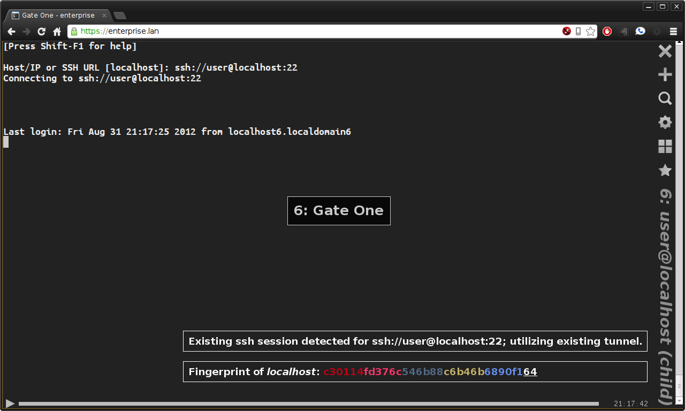
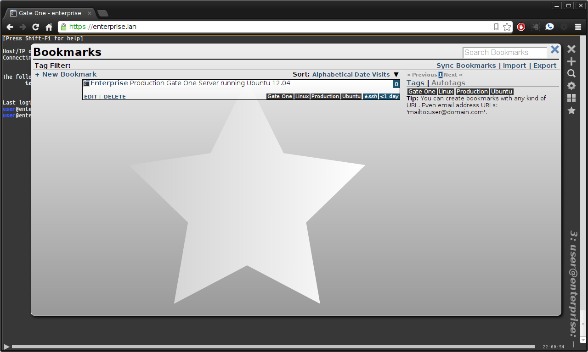
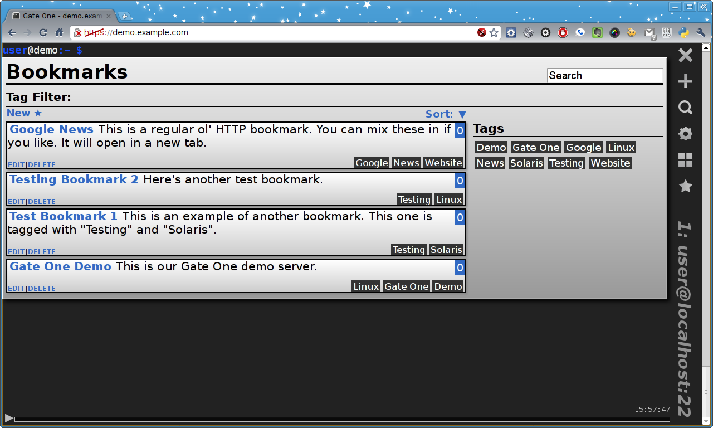
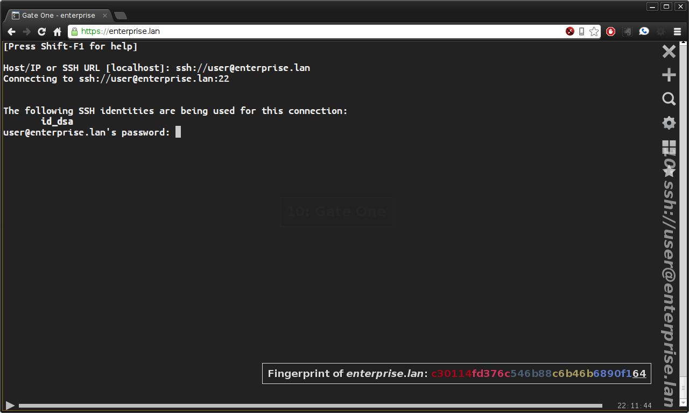

**********
User Guide
**********

The Interface
=============

When you first connect to a Gate One server you should see something like this:

.. figure:: screenshots/gateone_login.png
    :class: screenshot
    :align: center

    The default login screen with the SSH plugin enabled.

.. note:: The text zoom level was increased for all of these screenshots to make them easier to read.

Detailed Interface Overview
===========================
Here's an overview of what each GUI element does:

.. figure:: screenshots/gateone_login_explained.png
    :class: screenshot
    :align: center

    Gate One's interface, explained

Keyboard Shortcuts
==================

=================================== =======================
Function                            Shortcut
=================================== =======================
View The Help                       :kbd:`Shift-F1`
Open Terminal                       :kbd:`Control-Alt-N`
Close Terminal                      :kbd:`Control-Alt-W`
Show Grid                           :kbd:`Control-Alt-G`
Switch to the terminal on the left  :kbd:`Shift-LeftArrow`
Switch to the terminal on the right :kbd:`Shift-RightArrow`
Switch to the terminal above        :kbd:`Shift-UpArrow`
Switch to the terminal below        :kbd:`Shift-DownArrow`
=================================== =======================

The Toolbar
===========
Gate One's toolbar consists of a number of icons at the right of the window.  These icons are the main source of interaction with Gate One.  It should also be noted that all of Gate One's icons are inline SVG graphics...  So they will scale with your font size and will change color based on your CSS theme.  Another nice feature of the toolbar is that it's trivial for plugins to add their own icons.

.. note:: Why are the icons and title on the right and not the top?  Because these days monitors are much wider than they are tall.  In other words, vertical screen space is at a premium while there's plenty of room on the sides.

Close Terminal and New Terminal
-------------------------------
These icons do precisely what you'd expect from a modern GUI:  The X icon closes the terminal in the current view while the + icon opens a new terminal.

.. note:: If you close the last open terminal a new one will be opened.

Terminal Info and Tools
-----------------------

.. figure:: screenshots/gateone_infopanel.png
    :class: screenshot
    :align: center

    This is what you see when you click on the magnifying glass icon

Gate One's information panel is the place to get information about the current terminal.  By default, it will display the current terminal title, how long the terminal has been open, and the number of rows and columns.  It also presents some options to the user which are outlined below...

.. tip:: You can manually change the current terminal title by clicking on it.

Log Viewer
^^^^^^^^^^
Gate One's log viewer provides a mechanism for viewing the logs of terminal sessions stored on the server.  Log metadata as well as a preview can be viewed by simply clicking on any given log.  Playback and flat (traditional) viewing options are also available.  These will open in a new window.

.. figure:: screenshots/log_viewer.png
    :class: screenshot
    :align: center

    Gate One's log viewer

.. tip:: When you open the log viewer it will display a message indicating how many logs there are associated with your user account along with the total amount of space the logs are taking up on the server.

.. note:: Gate One's log format is pre-compressed using gzip.  There's no need to compress them.

Export Current Session
^^^^^^^^^^^^^^^^^^^^^^
When this button is clicked it will open up a new browser tab that will play back the current terminal's session.  This recording is self-contained and can be saved to your computer for playback later.  Everything needed to play back the recording is contained within the HTML file itself.  You can share it with friends, plop it into an iframe on a website, or just email it to someone.  It will even auto-scale itself (down) if necessary to fit within the current frame or window.

.. note:: This kind of session recording is merely a shortcut to quickly exporting the current terminal session.  You can always access your server-side session logs from within the log viewer.

Monitor for Activity/Inactivity
^^^^^^^^^^^^^^^^^^^^^^^^^^^^^^^
This feature allows you to monitor the current terminal for either activity (e.g. something changes) or inactivity (e.g. when the terminal stops changing).  When either of these events is triggered Gate One will play a sound and pop up an alert to notify you which terminal has passed the threshold for activity or inactivity.

.. tip:: This feature is very handy for when you want to know when, say, a download is complete (inactivity: "wget <url>" finishes) or when someone hits your website (activity: a "tail -f" on the log suddenly has output).

SSH Plugin: Duplicate Session
^^^^^^^^^^^^^^^^^^^^^^^^^^^^^
You'll see this option if the SSH plugin is enabled...  This button allows you to duplicate your current SSH session.  It will open a new SSH connection to the current server using the exact same SSH connect string (e.g. ssh://user@host:22) that was used to connect originally.  Also, if possible, it will utilize the existing SSH tunnel for this connection which means you won't have to re-enter your password.  When this (awesome) feature is invoked you'll see a message indicating as such in the terminal:

    After duplicating an SSH session.  No password required!

SSH Plugin: Manage Identities
^^^^^^^^^^^^^^^^^^^^^^^^^^^^^
The SSH plugin includes an interface for managing all of your SSH identities (aka SSH keys).  Here, SSH identities (private and public key files) can be generated, downloaded, uploaded, or deleted.  There is also support for uploading (or replacing existing) X.509 certificates that may be associated with a given identity.  X.509 support is important because it provides the ability for keys to be revoked (e.g. in the event that an employee leaves your company).  X.509 certificates can also restrict what privileges a user has when logging into a server via SSH (e.g. disallowing port forwarding).  If any of these restrictions are present in a given Identity's X.509 certificate they will be displayed in place of the randomart field.

.. figure:: screenshots/ssh_identity_manager.png
    :class: screenshot
    :align: center

    SSH Identity Manager

.. tip:: If you hover your mouse over the title of each column it will provide detailed description of what it means.

When you click on an identity you'll see a view such as this:

.. figure:: screenshots/ssh_identity_manager_idview.png
    :class: screenshot
    :align: center

    Identity Information

Edit Known Hosts
^^^^^^^^^^^^^^^^
Clicking this button will bring up an editor for Gate One's equivalent of ~/.ssh/known_hosts (same file, different location).  This will be handy if some server you connect to on a regular basis ever changes its host key...  You'll need to delete the corresponding line.

.. note:: Line numbers in the textarea are forthcoming (to make finding the appropriate host line easier).

The Settings Panel
------------------
.. figure:: screenshots/gateone_settingspanel.png
    :class: screenshot
    :align: center

    Gate One's Settings Panel

These options are detailed below...

Theme
^^^^^
This controls the look and feel of Gate One.  When selected, the chosen theme will take effect right away.

.. tip:: The CSS schemes can be edited; css_black.css and css_white.css are in <path to gateone>/templates/themes.

.. note:: The black scheme doesn't actually have a black background (it's #222)...  Why?  So the panels can have shadows which provides important contrast.  Essentially, it is easier on the eyes.

Color Scheme
^^^^^^^^^^^^
This is similar to the "Theme" option above but it only controls the colors of terminal text (aka renditions).

.. note:: CSS color schemes can be found in <path to gateone>/templates/term_colors.

Scrollback Buffer Lines
^^^^^^^^^^^^^^^^^^^^^^^
This option tells Gate One how many lines to keep in the scrollback buffer (in memory).  When you're typing or when a terminal is updating itself Gate One only updates the browser window with what falls within the terminal's rows and columns.  Only after a timeout of 3.5 seconds does it re-attach the scrollback buffer.  When this happens the browser has to render all that text; the more there is the longer it takes (milliseconds).  Even on a slow system 500 lines (the default) should be unnoticably speedy.

.. tip:: You don't have to wait for the 3.5 second timeout:  Just start scrolling and the timeout will be cancelled and the scrollback buffer will be immediately prepended to the current view.

.. note:: Why the complexity?  The more text that is being rendered, the slower the browser will be able to update your terminal window.  If we updated the current number of rows + the number of lines in the scrollback buffer every time you pressed a key this would quickly bog down your browser and make Gate One considerably less responsive.

Playback Frames
^^^^^^^^^^^^^^^
This option controls how many frames of real-time session playback will be kept in working memory.  The higher the number, the more memory it will use.  Also, the more terminals you have open the higher the memory use as well.  Having said that, 200-500 frames per terminal shouldn't be of any concern for a modern computer.

.. tip:: If you hold down the Shift key while scrolling with your mouse it will move backwards and forwards in the playback buffer instead of scrolling up and down.  It is a handy way to see the history of full-screen applications such as 'top'.

Terminal Rows and Terminal Columns
^^^^^^^^^^^^^^^^^^^^^^^^^^^^^^^^^^
By default these are blank which means Gate One will automatically figure out how many rows and columns will fit in a given terminal window.  If you set these, Gate One will force these values on all running terminal programs.  The ability to set this on a per-terminal basis is forthcoming.

.. note:: Why would anyone bother?  Some legacy/poorly-written terminal programs only work properly in a terminal window of 24 rows and 80 columns.

Gate One's Grid
---------------
Gate One lays out terminals in a grid like so:

==========  ==========
Terminal 1  Terminal 2
Terminal 3  Terminal 4
Terminal 5  Terminal 6
So on       And so on
==========  ==========

The grid view can be invoked by either clicking on the Grid icon (four squares) in the toolbar or via the Ctrl-Alt-G keyboard shortcut.  Here's what it looks like:

.. figure:: screenshots/gateone_grid_view.png
    :class: screenshot
    :align: center

    The Grid View.  The mouse was moved over Terminal 1 in this example, demonstrating the mouseover effect.

The Bookmark Manager
--------------------
The first time you open the Bookmarks manager it will be empty:

.. figure:: screenshots/gateone_bookmarks_empty.png
    :class: screenshot
    :align: center

    No bookmarks yet!

Bookmarks can be added by clicking on "New":

.. figure:: screenshots/gateone_new_bookmark1.png
    :class: screenshot
    :align: center

    The New Bookmark Form.

Here's an example of the new bookmark form, filled out with a new SSH bookmark:

.. figure:: screenshots/gateone_new_bookmark2.png
    :class: screenshot
    :align: center

    SSH Bookmark to the Gate One Demo Server

After submitting the form (which doesn't actually submit anything to the Gate One server) we can see our first bookmark in the panel:

    Finally, a bookmark!

Here's what the panel will look like after you've added a number of bookmarks:

    In this example we have both SSH bookmarks and an HTTP bookmark.

.. tip:: Clicking on any of those tags will filter the current view to only show bookmarks that have been tagged as such.

Lastly, here's what happens when you click on an SSH bookmark:

    This bookmark was automatically opened in a new terminal.

In the example above, the ssh:// URL was automatically entered for us.  All we had to do was enter our password.